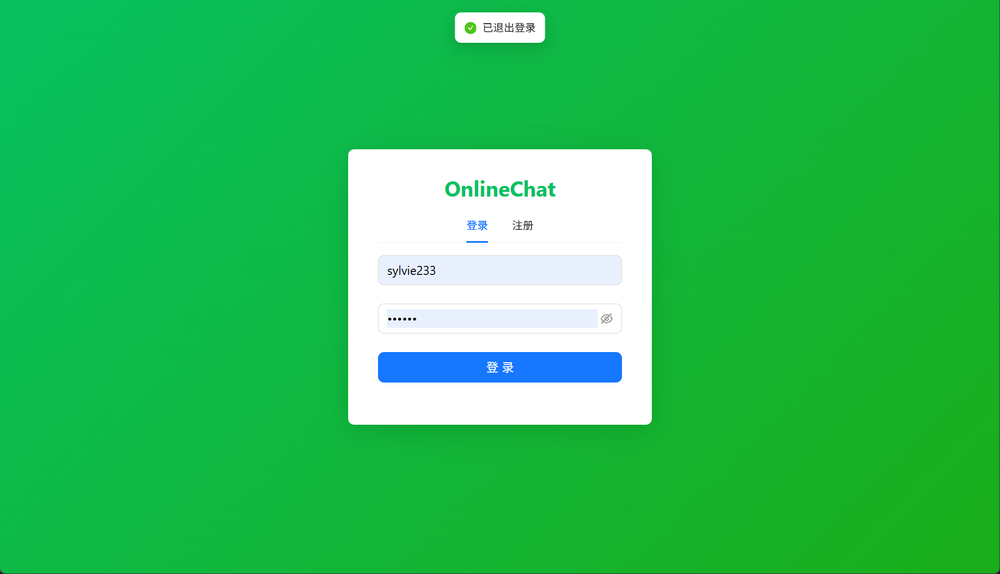
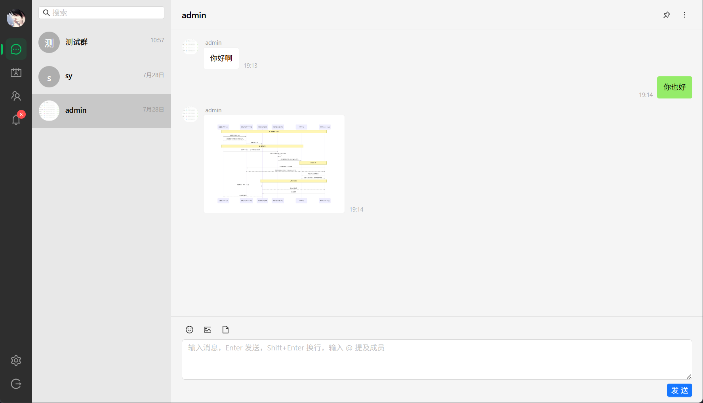
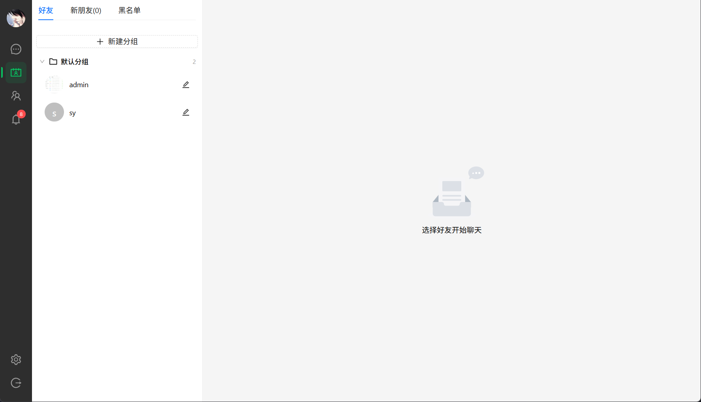
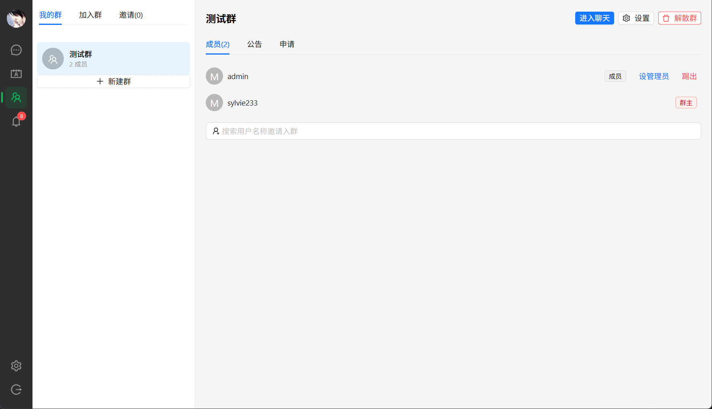
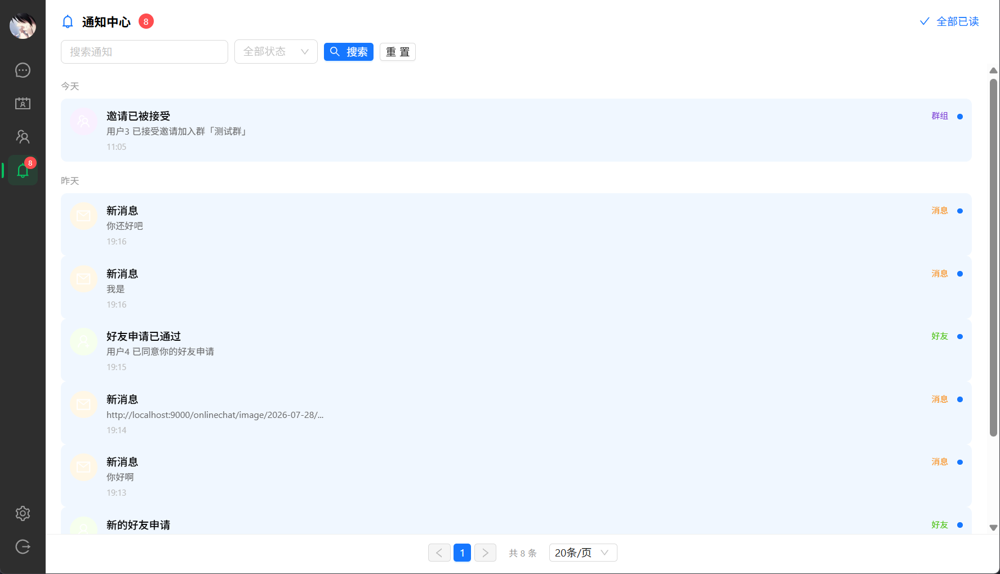
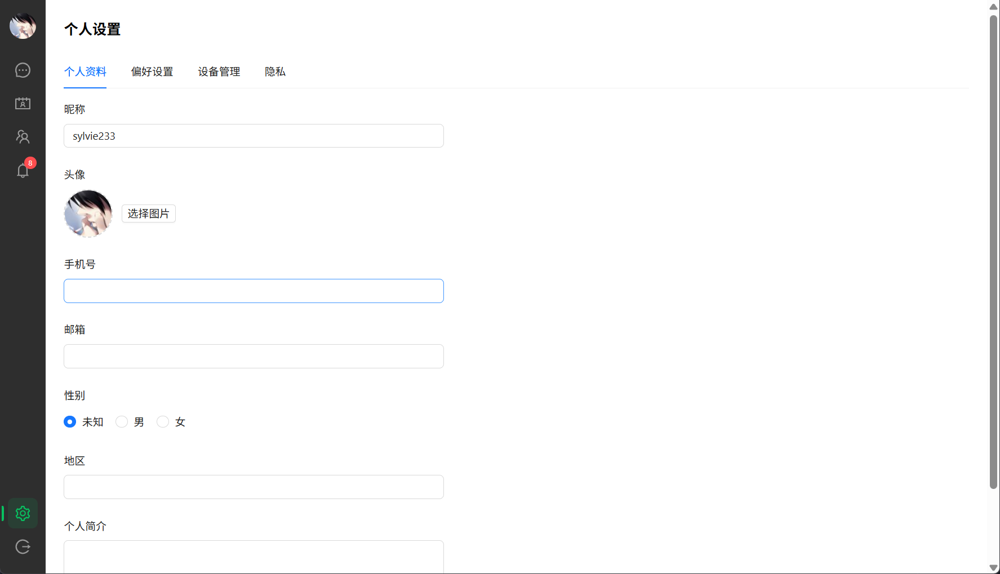

# OnlineChat

基于 Spring Boot + Netty + WebSocket 的在线 IM 即时通讯系统，前端采用 Vue3 + TypeScript + Ant-Design-Vue，客户端界面参考微信 PC 端设计。

## 项目预览

| 登录页面 | 会话页面 |
|:---:|:---:|
|  |  |

| 好友页面 | 群聊页面 |
|:---:|:---:|
|  |  |

| 通知页面 | 个人设置页面 |
|:---:|:---:|
|  |  |

## 功能特性

- **用户模块** — 注册/登录、个人资料、在线状态、多端登录（JWT + Refresh Token）
- **好友模块** — 好友分组、添加/删除好友、备注名、星标好友
- **消息收发** — 文本/图片/语音/视频/文件/位置等多种消息类型，完整送达链路（发送中 → 已发送 → 已送达 → 已读）
- **群组管理** — 创建/解散群、邀请/踢出成员、群公告（已读确认）、全员禁言、群内昵称
- **通知中心** — 好友申请、群邀请、@提醒、系统通知，已读/未读追踪
- **会话管理** — 置顶、免打扰、未读计数、草稿存储
- **消息进阶** — 撤回（2分钟内）、表情 Reaction、收藏、@提及、增量同步
- **文件管理** — 上传记录、缩略图、多存储后端（本地/OSS/MinIO/COS）
- **黑名单** — 拉黑/取消拉黑，拉黑后双向屏蔽消息

## 技术栈

### 后端

| 技术 | 版本 | 说明 |
|------|------|------|
| Spring Boot | 3.3.6 | 应用框架 |
| Netty | 4.1.115 | 高性能 WebSocket 通信 |
| MyBatis-Plus | 3.5.9 | ORM 数据库访问 |
| Redis | 7.4 | 缓存 & 会话管理 |
| MySQL | 8.0 | 关系型数据库 |
| Sa-Token | 1.39.0 | 权限认证 & 多端登录 |
| Knife4j | 4.5.0 | API 文档（基于 SpringDoc + Swagger） |
| MinIO | latest | 对象存储（图片/文件） |
| Maven | — | 多模块构建 |

### 前端

| 技术 | 说明 |
|------|------|
| Vue 3 | 渐进式前端框架 |
| TypeScript | 类型安全 |
| Vite | 构建工具 |
| Ant-Design-Vue | UI 组件库 |
| Pinia | 状态管理 |
| Vue Router | 路由管理 |
| pnpm | monorepo 包管理 |

## 项目结构

```
OnlineChat
├── backend/                        # 后端 Maven 多模块
│   ├── onlinechat-common/          # 公共模块（DTO、异常、工具类）
│   ├── onlinechat-repository/      # 数据访问层（Entity、Mapper）
│   ├── onlinechat-service/         # 业务逻辑层
│   ├── onlinechat-connect/         # Netty WebSocket 连接服务
│   ├── onlinechat-task/            # 定时任务 & 异步处理
│   ├── onlinechat-server/          # 启动入口 & Web 层（Controller）
│   └── pom.xml
├── frontend/                       # 前端 pnpm monorepo
│   ├── apps/
│   │   ├── client/                 # 客户端（IM 主界面）
│   │   └── admin/                  # 管理端
│   └── packages/
│       └── tsconfig/               # 共享 TS 配置
├── scripts/
│   ├── docker-compose.yml          # 中间件 & 应用容器编排
│   └── init.sql                    # 数据库初始化脚本
├── doc/                            # 项目文档 & 截图
├── build.ps1                       # 项目快速构建/运行脚本
└── README.md
```

## 快速开始

### 环境要求

- JDK 17+
- Maven 3.8+
- Node.js 18+ & pnpm
- Docker & Docker Compose

### 1. 启动中间件

```bash
docker compose -f scripts/docker-compose.yml up -d mysql redis minio
```

> 这会启动 MySQL（3306）、Redis（6379）、MinIO（9000/9001），并自动执行 `scripts/init.sql` 初始化数据库。

### 2. 启动后端

```bash
cd backend
mvn spring-boot:run -pl onlinechat-server
```

后端启动后：
- API 服务：`http://localhost:8080`
- WebSocket：`ws://localhost:9090`
- API 文档：`http://localhost:8080/doc.html`

### 3. 启动前端

```bash
cd frontend
pnpm install
pnpm --filter @onlinechat/client dev    # 客户端 → http://localhost:3000
pnpm --filter @onlinechat/admin dev     # 管理端 → http://localhost:3001
```

### 4. 使用 build.ps1 快速开发

```powershell
./build.ps1 dev    # 一键启动中间件 + 显示开发指引
./build.ps1 logs   # 实时查看后端日志
```

## 数据库设计


